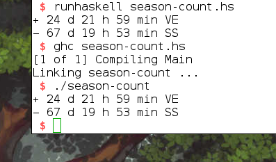

# season-count
Some equinox and solstice countdown calculations



Compile `season-count`:
```
$ ghc season-count.hs
```

Run it:
```
 $ ./season-count
+ 25 d 19 h 39 min VE
− 66 d 22 h 13 min SS
```
This example is run on a Linux machine, but compiling it on Windows should go accordingly.

Further instructions: [guide.md](guide.md)
