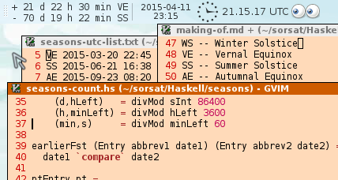

# Season-count

Our goal: to show a calendar with day-count from and to nearest equinox or solstice.

```
 $ ./season-count 
+ 23 d 14 h 37 min VE
− 69 d 3 h 15 min SS
```

The following abbreviations are used:

```
WS -- Winter Solstice
VE -- Vernal Equinox
SS -- Summer Solstice
AE -- Autumnal Equinox
```

## gcal

We get the list from the output of running the command `gcal`

```
$ gcal --astronomical-holidays -cey 2014+2060 | grep -E 'Equinox|Solstice' >seasons-list.txt
```
It gives the text file `seasons-list.txt`:

```
Th,  20 Mar 2014: Equinox Day 16:57 (Ast)
Sa,  21 Jun 2014: Solstice Day 10:51 (Ast)
Tu,  23 Sep 2014: Equinox Day 02:29 (Ast)
Su,  21 Dec 2014: Solstice Day 23:03 (Ast)
Fr,  20 Mar 2015: Equinox Day 22:45 (Ast)
Su,  21 Jun 2015: Solstice Day 16:38 (Ast)
We,  23 Sep 2015: Equinox Day 08:20 (Ast)
Tu,  22 Dec 2015: Solstice Day 04:48 (Ast)
Su,  20 Mar 2016: Equinox Day 04:30 (Ast)
Mo,  20 Jun 2016: Solstice Day 22:34 (Ast)
Th,  22 Sep 2016: Equinox Day 14:21 (Ast)
We,  21 Dec 2016: Solstice Day 10:44 (Ast)
...
```

`Ast` appears to be the time (and day) in UTC. (Probably a bug in gcal.)

> "Lauantaina 21.3. klo 0.45 on kevätpäiväntasaus. Tämä on hetki, jolloin Auringon kiekon keskipiste ylittää taivaanpallon ekvaattorin ja siirtyy eteläiseltä pallonpuoliskolta pohjoiselle. Tällöin Auringon sanotaan olevan kevättasauspisteessä ja sen koordinaatit ovat: deklinaatio = 0 astetta ja rektaskensio = 0 tuntia. "

https://www.ursa.fi/taivaalla/tahtitaivas-tanaan/2015/maaliskuu/aurinko-ja-kuu.html

## seasons-count-parse

```
Prelude Data.Time> let bree = read "1981-06-16 04:35:25" :: UTCTime
Prelude Data.Time> bree
1981-06-16 04:35:25 UTC
```

```
$ runhaskell seasons-count-parse.hs >seasons-utc-list.txt
```

Running the program gives the text file `seasons-utc-list.txt`:

```
VE 2014-03-20 16:57
SS 2014-06-21 10:51
AE 2014-09-23 02:29
WS 2014-12-21 23:03
VE 2015-03-20 22:45
SS 2015-06-21 16:38
AE 2015-09-23 08:20
WS 2015-12-22 04:48
VE 2016-03-20 04:30
SS 2016-06-20 22:34
AE 2016-09-22 14:21
WS 2016-12-21 10:44
...
```

## parse-list-to-tuples.hs

Running the program `parse-list-to-tuples.hs` gives the output:

```
$ runhaskell parse-list-to-tuples.hs 
  ("VE","2014-03-20 16:57"),
  ("SS","2014-06-21 10:51"),
  ("AE","2014-09-23 02:29"),
  ("WS","2014-12-21 23:03"),
  ("VE","2015-03-20 22:45"),
  ("SS","2015-06-21 16:38"),
...
```

We copy it into the end of file `season-count.hs`.

## season-count

Get current time in POSIXTime

```
pt  <- getPOSIXTime
```
### Datatypes 

Eech entry is represented by the datatype `Entry`:

```
data Entry = Entry {
  abbrev :: String, 
  date :: String 
} deriving (Show,Eq)
```

Parse the file `seasons-utc-list.txt`. Each entry is parsed by taking 2 characters to represent the field `abbrev` and everything after the third character to represent the field `date`.

```
createEntry str = 
  Entry {
    abbrev = abbrev, 
    date = date
  } where
    abbrev = take 2 str
    date = drop 3 str
```

Similarly we could create an `Entry` from the current moment, and hide it inside the list, so we get the position where it belongs.

```
ptEntry pt =
  Entry { 
    abbrev = abbrev, 
    date = date 
  } where
    abbrev = "NOW"
    date = formatTime defaultTimeLocale "%Y-%m-%d %H:%M" (
             utcToLocalTime utc (posixSecondsToUTCTime pt))
```
### Compiling and testing

```
 $ PS1="\[\033[01;31m\] $ \[\033[00m\]"
 $ runhaskell season-count.hs
+ 23 d 14 h 20 min VE
− 69 d 3 h 32 min SS
 $ ghc season-count.hs
[1 of 1] Compiling Main             ( season-count.hs, season-count.o )
Linking season-count ...
 $ ./season-count 
+ 23 d 14 h 20 min VE
− 69 d 3 h 32 min SS
```

### Usage examples

#### In terminal


#### As generic monitor in XFCE panel



